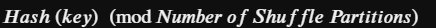
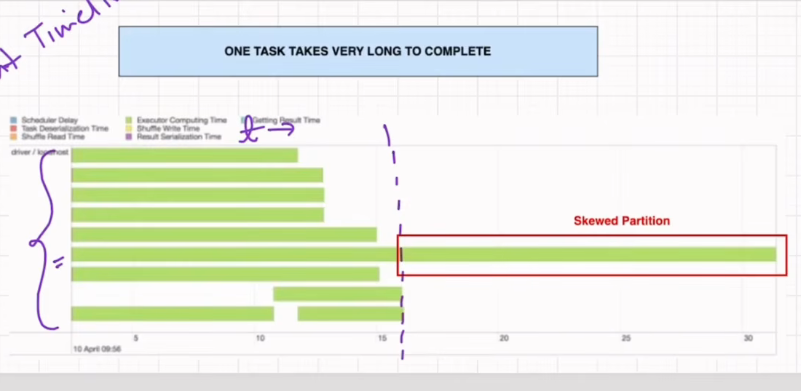
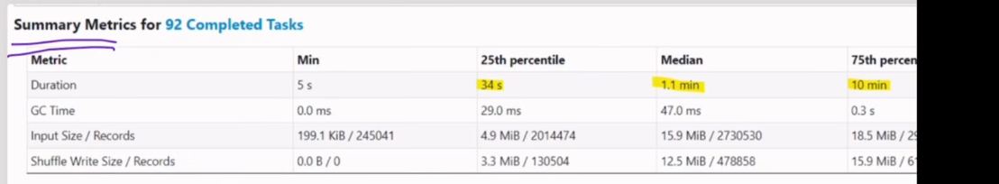

## What is Sort Merge Join ? 

- Sort-Merge Join (SMJ) is the default and highly scalable join strategy in Apache Spark used to join two large datasets when neither dataset can fit into memory.

* Spark chooses the Sort Merge Join strategy when two primary conditions are met:

1. Large Data Sets: Both data frames exceed the `spark.sql.autoBroadcastJoinThreshold`(default is 10 MB). Since neither table is small enough to be broadcast, Spark defaults to this strategy as it can handle large data without loading full sets into memory.

2. Equi-Join Keys: The join condition must be an equi-join (e.g., df1.x == df2.x). The join keys must also be sortable, allowing Spark to organize them into order to perform the join.

# Phases of Sort Merge Join
The process consists of three distinct phases: 

1. Shuffle: Data is redistributed across the cluster so that rows with the same join key end up in the same partition.

2. Sort: Rows within each partition are sorted by the join key to prepare for the merging process. 

3. Merge: Spark iterates through the sorted partitions using pointers to match and join rows with identical keys.

## How to Calculate the target Partition for a particular Key.
1. To perform the shuffle and ensure keys land in the correct partition, Spark calculates the target partition using the following logic:



2. This calculation ensures that for any given key, the result is always a value between 0 and the number of shuffle partitions, dictating exactly where that key is sent during the shuffle

## What is InMemoryFileIndex while reading the spark physical plan? 

- In Apache Spark, an InMemoryFileIndex is a component used by Spark to manage file discovery and metadata.

* Its primary responsibilities include:

1. File Listing: It identifies and lists all the files present at a specified path or directory.

2. Metadata Management: It tracks essential details such as file sizes, partition values, and other file-level metadata.

3. Driver Storage: This information is kept in the driver's memory , which allows Spark to efficiently plan the execution of a job by understanding exactly what data needs to be read without having to re-scan the file system repeatedly.

## Where the actual Data stored then?

- The InMemoryFileIndex  only stores metadata—essentially a map of where files are located and their basic properties. The actual data resides in external storage systems, which Spark reads during execution:

1. Distributed File Systems: Most commonly, the data is stored in systems like HDFS (Hadoop Distributed File System) or cloud-based object storage like Amazon S3, Azure Data Lake Storage (ADLS), or Google Cloud Storage.

2. Local Storage: In smaller or development environments, data can reside on the local disk of the nodes in the cluster.

3. When a job runs, Spark's executors pull this raw data from these external storage locations into their own memory (or local scratch space/disk) to process it, rather than keeping the full dataset in the InMemoryFileIndex itself.


## what is cost based optimizer(cbo)? 

1. CBO stands for Cost-Based Optimizer. It is part of Spark SQL's optimization framework and uses statistics about tables and columns, such as row counts, data sizes, and distinct values, to estimate the cost of different execution plans and choose a more efficient one.

2. For example, in a multi-table join, CBO can help Spark choose a better join order or physical strategy when sufficient statistics are available.

3. Catalyst is the broader query optimization framework, while CBO is the statistics-driven optimization capability within it.

4. CBO is different from AQE because CBO primarily makes decisions during planning using available statistics, whereas AQE can modify the plan at runtime using actual execution statistics.

```Catalyst = Optimization framework
CBO      = Uses statistics to choose cheaper plans
AQE      = Uses runtime statistics to adapt the plan
----------------------------------------------------
Catalyst asks: "What optimizations are possible?"
CBO asks: "Which option is cheaper based on the statistics?"
AQE asks: "Now that I know what actually happened, should I change the plan?
```


## what is Brodcast Hashjoin, ? what are the conditions required to perform the brodcast hash join? 


- A Broadcast Hash Join is a join strategy used in Apache Spark where a small table is sent to every executor by driver  to perform a join without shuffling the larger table.

* Spark chooses this join strategy under the following conditions:

1. Size Threshold: One of the tables must be small enough to fit entirely into the memory of each executor. Specifically, the estimated size of the table must be below the value defined by the `spark.sql.autoBroadcastJoinThreshold` property, which has a default value of 10 megabytes.

## What are the steps Performed in BrodcastHash Join?

1. Broadcast Phase: 
- The driver serializes the smaller table and pushes a full copy of it to every executor in the cluster. This avoids the need for a shuffle of the larger table. 

2. Build Phase: 
- Each executor takes the small table copy it received and iterates over the rows to construct a hash map table in its local memory. This map is keyed on the join column, allowing for efficient lookups.

3. Probe Phase: 
Each executor streams its partition of the larger table row-by-row, using the join key to look up matches within the local hash map. If a match is found, the joined row is produced. 


## What is Brodcast mode in Brodcast hash join? 
- Define- Broadcast mode is the mechanism Spark uses to prepare and distribute the small side of a join to all executors.

- In Spark's physical planning, you can encounter different broadcast exchange modes

1. ### HashedRelationBroadcastMode
```Small Dataset
     ↓
Build hashed relation
     ↓
Broadcast
     ↓
Executors
```
- The small brodcasting dataset is prepared as a hashed relation keyed by the join keys.

2. ### IdentityBroadcastMode

```Data
 ↓
Serialize
 ↓
Broadcast as-is
```
- This broadcasts the small dataset without constructing the join-key-based hashed relation.
- It is used in situations where the receiving executor/operator needs the broadcasted data in its original/identity form rather than as a hashed join relation.

## What is Shuffle Hash Join ?

-Spark chooses a Shuffle Hash Join  when the data size is too large for a Broadcast Hash Join, but does not necessarily require the full overhead of a Sort Merge Join.

### Specifically, it is selected under these conditions:

1. Size Mismatch: The smaller table is too large to fit entirely in the memory of every executor `(exceeding the spark.sql.autoBroadcastJoinThreshold)`, meaning it cannot be broadcasted.
2. Partition Viability: After the data is redistributed via a shuffle, the resulting partition of the smaller table on each individual executor is small enough to fit into memory.
3.  Capability: The executor has sufficient memory to build a hash table from that smaller partition 
4. Note on Preference: By default, Spark prefers Sort Merge Join because it is considered more memory-stable (50:17), particularly when dealing with skewed keys that could trigger an out-of-memory error during hash table construction. To force Spark to use a Shuffle Hash Join when viable, you must set the configuration `spark.sql.join.preferSortMergeJoin` to false .

```

Executor 1

Customers partition
       |
       v
Build Hash Table
       |
       v
Orders partition
       |
       v
Hash lookup
       |
       v
Result

```
---

| Feature       | Broadcast Hash Join               | Shuffle Hash Join                         |
| ------------- | --------------------------------- | ----------------------------------------- |
| Shuffle       | Large side avoids shuffle         | Both sides shuffle                        |
| Small side    | Must be small enough to broadcast | Only needs to be manageable per partition |
| Hash table    | Broadcast side                    | Smaller shuffled side in each task        |
| Network       | Lower                             | Higher                                    |
| Memory        | Broadcast copy on each executor   | Hash table per task                       |
| Best case     | Tiny + huge                       | Medium-small + large                      |
| Main risk     | Broadcast memory/timeout          | Large per-partition hash table            |
| Sort required | No                                | No                                        |


## What is BrodcastNested Loop Join in Spark
- Broadcast Nested Loop Join broadcasts one side and then compares rows using a nested-loop strategy.

## Condition for BrodcastNested Join in Spark? 

Spark chooses a Broadcast Nested Loop Join :
 based on specific join conditions and table sizing requirements:

1. Non-Equi Join Predicates: This is the primary condition. It is chosen when the join condition does not contain an equality clause (e.g., greater than, less than, between, or not equal to).

2. Cross Joins: It is also used when performing a cross join where there is no join condition specified at all, requiring every row from one table to be paired with every row from the other.

3. Broadcastable Table: For the join to execute, at least one of the two tables must be small enough to be serialized by the driver and broadcasted in full to every executor.

Unlike other joins, this strategy involves no shuffling of the larger table. Instead, it performs a nested loop where each executor compares its partition of the large table against the full broadcasted copy of the smaller table.

## What is Skew Data ? 

- Data skew refers to the situation in data processing, such as in Apache Spark jobs, where data is unevenly distributed across partitions.

- Instead of having a balanced load, some partitions end up holding significantly more data than others, which creates several performance issues:

- Uneven Resource Utilization: While some processing cores finish their tasks quickly, others may stay stuck processing a massive partition, leading to idle resources and wasted computation power.

### Causes
- Increased Runtime: Jobs often get stuck at the "last task," where a single executor is forced to handle the bulk of the work, significantly slowing down the total job completion time.

- Memory Errors: Oversized partitions can lead to out-of-memory errors or costly data spills to disk, as the executor struggles to hold the excessive amount of data in memory.

## How to identify the Data Skew On Spark UI

### To identify data skew in your Apache Spark jobs, you should monitor the Spark UI for the following signs:

1. Stuck Tasks: If your job consistently gets stuck at the "last task" for an extended period, it often indicates that one partition contains significantly more data than the others, forcing a single executor to handle the bulk of the workload.

2. Event Timeline Discrepancies: By checking the event timeline in the stage view, you can visually spot imbalances. You will see that while most partitions complete processing quickly, one partition remains active, with a much longer "executor computing time" (shown in green) compared to the rest .



3. Task Summary Metrics: Compare the task duration metrics. A massive gap between the minimum time (e.g., 5 seconds) and the maximum time (e.g., 31 minutes) is a clear indicator that data is unevenly distributed across your partitions.



## What Operations Caused Data Skew? 

1. #### Aggregation Operations: 
- Operations like a group by can cause skew when the distribution of the grouping key is uneven. For example, if you are counting transactions per country and one country has significantly more transactions than others, the partition handling that specific country will be overloaded.

2. #### Join Operations: 
- When joining two datasets, such as joining an "order line" dataset with a "products" dataset using a common "product ID," skew occurs if one key appears much more frequently than others. The partition assigned to that specific join key will then take much longer to process than the rest.