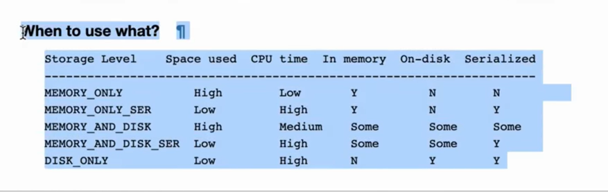

## What is caching? 

- Caching is a critical performance optimization technique that allows you to store a DataFrame in memory, on disk, or both.

### Why use Caching?
1. Avoid Recomputation: Spark uses lazy evaluation, meaning it doesn't calculate transformations until an action is called. Without caching, if you use the same DataFrame multiple times for different downstream operations, Spark will re-evaluate the entire lineage graph (the sequence of transformations) from scratch every time.

2. Performance Gains: By caching a DataFrame, Spark saves the results of those expensive transformations. Subsequent operations can then perform an "in-memory table scan" instead of re-reading or re-computing the data, saving significant CPU resources and time.

## Cache vs. Persist
#### Cache: 
- A simplified method that uses the default storage level: Memory and Disk (Deserialized).

#### Persist:
 A more flexible method that allows you to specify a custom StorageLevel, such as MEMORY_ONLY, DISK_ONLY, or varying levels of replication for added fault tolerance.

### Storage Levels
You can choose storage levels based on your specific needs regarding memory usage and CPU cycles:

#### Memory Only: 
Fast, but uses more RAM as data is stored as deserialized JVM objects.

#### Memory Only (Serialized): 
More compact, saving memory space, but requires additional CPU cycles to deserialize when read .

- In Apache Spark, you can use various storage levels to define how your DataFrames are cached. Each level offers a different trade-off between memory usage, disk space, and CPU performance (

### Common storage levels include:

1. ### MEMORY_ONLY: 
- Stores the DataFrame as deserialized Java objects in memory. This is the fastest option because it avoids deserialization overhead, but it consumes the most memory space.

2. ### MEMORY_AND_DISK: 
- The default setting if no level is specified. It stores data in memory, but if the DataFrame exceeds available RAM, the remaining partitions are spilled to the disk.

3. #### MEMORY_ONLY_SER: 
- Stores data in memory in a serialized format (as bytes). This is more compact than deserialized storage, saving memory space, but requires additional CPU cycles to deserialize the data when accessed.

4. #### DISK_ONLY: 
- Bypasses memory entirely and stores the data only on the disk in a serialized format. This is useful for large datasets that do not fit in memory but are still reused frequently across operations.

--- 
Additionally, many of these levels have variants with a suffix of '2' (e.g., MEMORY_ONLY_2), which instructs Spark to replicate the data on two cluster nodes for increased fault tolerance.
