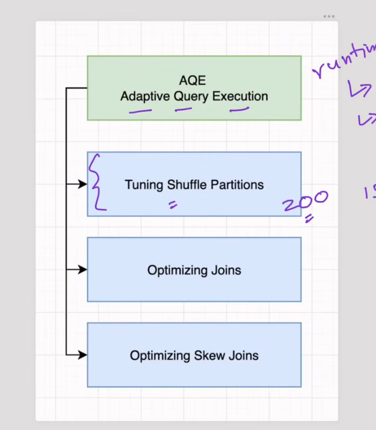

### What is Salting ?
- Salting improves performance by preventing data skew in Apache Spark operations like joins and aggregations.  When a specific key appears too frequently in a dataset, it overloads a single shuffle partition, creating a bottleneck.

- By adding a random salt value to the join or group-by key, the data is distributed across multiple partitions rather than being concentrated on one node.
- This ensures that the computational load is spread more evenly, allowing parallel processing to happen efficiently

## Salting in Joins (Steps to apply the salting)

- To mitigate data skew in Apache Spark, salting adds randomness to your join or group-by keys to ensure data is evenly distributed across shuffle partitions. 
- Here are the steps for both scenarios:

### Implementing Salting in Joins :

1. Choose a Salt Number: Select a value that represents how much you want to distribute the skewed data.
2. Salt the First Data Frame: Add a new column with random integers between 0 and your salt number (eg. column_name- Salt_number).

3. Prepare the Second Data Frame: Create an array column of all possible salt values (0 to salt number - 1) and use the explode function to replicate rows for every possible salt value.

4. Join: Perform the join using both the original key and the new salt column.

### Implementing the salting in groupBy()>

1. Choose a Salt Number: Select a number based on your shuffle partition distribution.

2. Add Salt Column: Assign a random integer (0 to salt number - 1) to each row in your data frame 

3. Initial Aggregation: Perform a groupBy using both the original value column and the new salt column to perform a partial count/aggregation (21:14).

4. Final Aggregation: Perform a second groupBy on the original value column only, summing the partial counts obtained from the previous step to arrive at the final result 

### How to Choose a correct salt number?

1. Purpose: The salt number determines the degree to which you distribute your skewed data across your shuffle partitions.

2. Avoid Too Small: If you choose a number that is too small, your data will remain "jam-packed" into a single partition, failing to resolve the skew.

3. Avoid Too Large: If you choose a number that is too large, you risk over-fragmenting your data into very tiny, inefficient pieces, which can also degrade performance.
* Practical Tip: Start by looking at your current shuffle partition count. The goal is to choose a number that ensures your data is spread more evenly across those available partitions.

----
* Refer the Salting Practical example in ([Pyspark_Examples](../../pyspark_scenarios.ipynb))

--- 
## Another Methods to handled the skew data 

1. ## AQE
 - (AQE): Enable Spark's built-in skew join optimization (spark.sql.adaptive.skewJoin.enabled), which automatically detects and splits oversized shuffle partitions during runtime.

 - AQE, or Adaptive Query Execution, allows Spark to modify the physical execution plan at runtime using actual statistics collected during execution. This is different from traditional planning, where Spark largely relies on estimates before execution. For data skew, after a shuffle stage completes, AQE examines the actual sizes of shuffle partitions. If a partition is significantly larger than the median and exceeds the configured skew threshold, Spark can identify it as skewed and split that partition into smaller pieces. 
 
 - For a skewed join, Spark can process those pieces in parallel, preventing one large partition from becoming a long-running straggler task. AQE also provides other optimizations such as coalescing small post-shuffle partitions and adapting join strategies, including converting a sort-merge join to a broadcast join when runtime statistics show that a side is small enough
 
 

2. ## Broadcast Joins: 
Use the broadcast function (broadcast()) to send a small lookup table to all worker nodes entirely, avoiding the shuffle phase and any associated join-key skew.

3. ## Isolating Skewed Keys: 
- Filter out extremely heavy or null keys, process them separately (such as via a dedicated broadcast join), and combine the final results using a union operation.

4. ## Custom Partitioning & Bucketing: 
Pre-organize data files using table bucketing (bucketBy) or define custom partition logic so that frequently joined columns distribute records more uniformly

