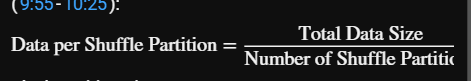
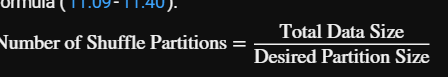
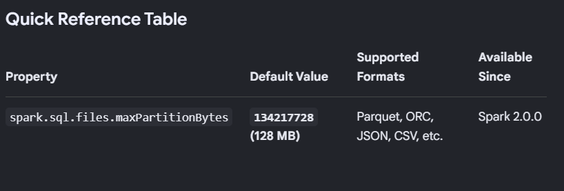

## What is Shuffling?

1. In Apache Spark, shuffling is a process that occurs during wide transformations (such as group by or join operations) to rearrange data across the cluster (0:26-0:31).

### Why it happens: 
- The goal is to bring together related data that currently resides on different nodes in the cluster so that operations like aggregations can be performed efficiently.

### How it works: 
- Data is redistributed across the network into new partitions, known as shuffle partitions, which are then processed by the cluster's cores

#### Why are shuffle partitions important for performance? What is data skew in Spark? how to tune and set shuffle partition? how to calculate the data on each partitio, what is the forrmula, what shoudl be the idea partion size?

- To optimize your Spark jobs, tuning shuffle partitions is essential. Improperly configured partitions can lead to significant performance bottlenecks or under-utilization of your cluster resources.

* The Formula for Partition Size
- To calculate the amount of data processed by each core (per shuffle partition), use the following formula 

* Ideal Partition Size
`According to best practices, the optimal size for each shuffle partition should fall within the range of 1 MB to 200 MB`

### How to Tune
- To achieve the ideal balance, you can adjust the spark.sql.shuffle.partitions property.

- Determine the workload: 

- Check the Spark UI to find the total amount of data being shuffled 
Calculate the target: Divide your total shuffle data size by the desired partition size (e.g., 200 MB) to get the required number of partitions 

- Set the property: Update your configuration using spark.conf.set("spark.sql.shuffle.partitions", [calculated_number]).

`Important Note: If your data per partition is too small, your cluster resources will sit idle because you have more partitions than available cores. Conversely, if it is too large, the processing time will increase significantly.`

### how to calculate the number of shuffle partiotion based on desired size

- To determine the ideal number of shuffle partitions, you can use a straightforward calculation based on your total data size and your target partition size (typically between 1 MB and 200 MB).

- The Calculation Formula
- To find the number of partitions needed, use this formula

## Practical Steps for Tuning
1. Analyze your data: Check the Spark UI during a job run to identify the exact amount of data being shuffled.
2. Define your target: Decide on an optimal size for each partition (e.g., 200 MB).
Calculate: Divide the total shuffled data size (e.g., 300 GB) by your target size (e.g., 200 MB) .
3. Apply the setting: Update the configuration in your code using spark.conf.set("spark.sql.shuffle.partitions", [calculated_number]) .
Key Considerations:

- Too few partitions: Each core processes too much data, leading to slow performance .
- Too many partitions: Data per partition becomes too small (e.g., a few KB), resulting in overhead and idle cluster resources (13:35-13:50).
Cluster utilization: Ensure your choice also aligns with the number of available cores in your cluster to avoid wasting resources.

## What is the Spark UI shuffle tab?

- There is no single "Shuffle tab" in the Spark UI; instead, shuffle metrics are distributed across several tabs to help you monitor performance and troubleshoot bottlenecks. To inspect shuffle activity, you should navigate to the following areas:

1. Stages Tab: This is the most critical place for analyzing shuffle performance. When you click into a specific stage, you can view Shuffle Read (data read by reducers) and Shuffle Write (data written by mappers) metrics. This is also where you can identify Shuffle Spill (memory vs. disk), which indicates when your executors run out of memory and start writing to disk.
2. Executors Tab: This provides a high-level summary of shuffle metrics per executor. It is useful for identifying if specific nodes are performing a disproportionate amount of shuffle work, which can highlight issues like data skew.

3. SQL Tab: If you are using Spark SQL, the SQL tab allows you to view the Query Plan. This is vital for seeing if your joins or aggregations are triggering inefficient shuffle operations.

## What is shuffle spill?
- Shuffle spill occurs in Apache Spark when a task performs a transformation (like a join or aggregation) that requires more memory than is available in the executor's execution memory. When this happens, Spark is forced to move intermediate data from RAM (memory) to disk to free up space. This process is significantly slower than in-memory processing and is a common indicator of performance bottlenecks.

- Key Metrics
In the Spark UI, you will typically see Shuffle spill reported as a pair of values:

1. Shuffle spill (memory): The size of the de-serialized data in memory at the time it was forced to spill to disk.
Shuffle spill (disk): The actual size of the serialized data written to the disk.

## Common Causes and Fixes
1. Insufficient Executor Memory: If your tasks are memory-intensive, you may need to increase the memory allocated to your executors.

2. Oversized Partitions: If the amount of data per shuffle partition is too large, it exceeds the memory buffer. You can often fix this by increasing the number of shuffle partitions using spark.sql.shuffle.partitions.

3. Data Skew: If one partition is significantly larger than others (due to unevenly distributed keys), that specific task will spill even if others do not. Solutions include salting or enabling Adaptive Query Execution (AQE).
Inefficient Operations: Ensure you are using optimal transformations; for example, using reduceByKey instead of groupByKey can help reduce the amount of data shuffled.

## Problems that partitioning solves and how it solves?

- Partitioning in Apache Spark is an optimization technique primarily used to break down large datasets into smaller, more manageable chunks.
it addresses two fundamental problems in big data processing:

1. Efficient Data Searching: Much like organizing a bookshelf into sections by author or genre, partitioning reduces the search space. When you query data, Spark doesn't need to scan the entire dataset; it can directly target the specific partition that contains the relevant records, significantly speeding up query performance.

2. Improved Parallelism and Resource Utilization:

Maximizing Resources: By splitting data into multiple partitions, Spark can distribute tasks across multiple executor cores simultaneously, ensuring that your cluster's CPU and memory are fully utilized rather than leaving most cores idle.

- Avoiding Bottlenecks: Without proper partitioning, a massive, unpartitioned file might be processed by a single core, causing a major bottleneck. Conversely, creating too many tiny partitions can lead to the.

## How to choose , which column wll be good fit for partitioning?

- Selecting the right column for partitioning is critical for performance. 
consider these two main factors when making your choice:

* Cardinality (The number of unique values in a column):

1. Avoid High Cardinality: Do not use columns like Customer ID or transaction IDs. These create too many small, inefficient partitions, which prevents Spark from effectively narrowing down the data.

2. Aim for Low-to-Medium Cardinality: Columns like State, Date, or Category are ideal. They create a manageable number of chunks that allow Spark to skip unnecessary data.

3. Avoid Extremely Low Cardinality: Do not pick a column where almost every row belongs to the same value, as this results in essentially no partitioning.

* Frequency of Filter Conditions:

Always choose a column that you frequently use in your WHERE clauses. 
If your queries consistently filter by listen_date, partitioning by that column allows Spark to directly access only the relevant folders, making your queries much faster.

## how to handle the number of partitions file by each partition?
- To control the number of files generated inside your partitions, you can use the repartition function before applying the partitionBy operation.
* Here is how you can manage this:

1. Using repartition(n): This allows you to explicitly set the number of files (partitions) for your data. By running `df.repartition(3).write.partitionBy('listen_date')...`, 
you force Spark to create exactly 3 files within each listen_date folder.

2. ## Opposite
 The behavior of `coalesce`: It is important to note that using coalesce instead of repartition may not yield the expected number of files. Because coalesce aims to avoid a full shuffle, it often defaults to the existing number of partitions defined by the partitionBy operation, effectively ignoring your request if you try to increase the file count.
Essentially, use repartition when you want to force a specific file count per partition, even though it involves a shuffle 

## What is `spark.sql.files.maxPartitionBytes`? 

- The `spark.sql.files.maxPartitionBytes`
 property is a configuration setting in Apache Spark that determines the maximum size of a single partition when reading files.

- Here is how it functions:

1. Splitting Files: It tells Spark to divide large input files into smaller, manageable chunks based on the byte size you specify. 

- For example, if you set this to 128 MB and have a 512 MB file, Spark will split it into four partitions of 128 MB each.

2. Controlling Parallelism: By adjusting this value, you can influence how many tasks Spark creates during the read operation. Smaller values lead to more, smaller partitions, which can increase parallelism but might lead to overhead if they become too small.

3. Read-Time Impact: This property specifically affects the data at the read time when you first load your dataset into a DataFrame, helping you avoid processing massive, singular files that would otherwise be handled by a single core.

## Practical Optimization 
- Use CasesModifying this value allows data engineers to balance cluster parallelism against metadata overhead:

1. Decrease the value (e.g., down to 32 MB or 64 MB) if you have massive source files and your cluster has unutilized CPU cores. Smaller partition bytes force Spark to generate more partitions, increasing total job concurrency.

2. Increase the value (e.g., up to 256 MB or 512 MB) if you are facing OutOfMemoryError (OOM) issues due to high GC overhead or too many concurrent tasks. It is also useful if your data features wide schemas with complex string objects that expand significantly when uncompressed into memory.

* Python
`spark.conf.set("spark.sql.files.maxPartitionBytes", "67108864")`

* Scala/SparkSql

`spark.conf.set("spark.sql.files.maxPartitionBytes", 268435456)`

- For controlling partitions during joins, group-bys, or aggregations, modify `spark.sql.shuffle.partitions` or rely on Adaptive Query Execution (AQE) using `spark.sql.adaptive.advisoryPartitionSizeInBytes` instead.

